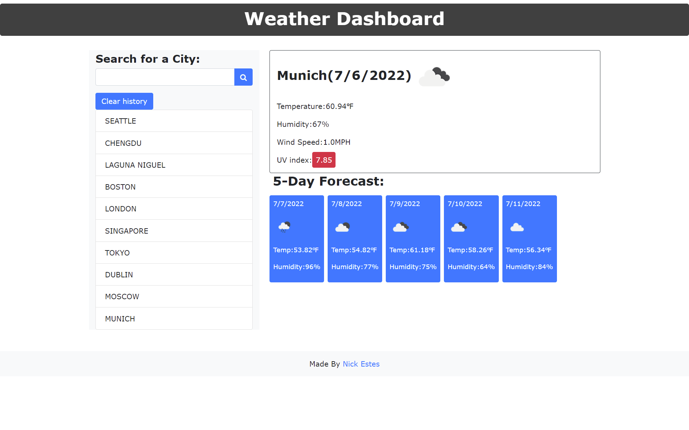

## And now to your local weather

URL: https://nickjestes.github.io/and-now-to-your-local-weather/

The website brings up weather based on any search, your recent history will be displayed
and can be removed with a clear button.

The website uses bootstrap and jQuery primarily alongside the openweathermap API.

This is my first time using AJAX, used to draw information from a separate server to update the 
info on the main page.

This is a demonstration of the website running. You can see the history to the left side and the current weather
(set to Munich, Germany). The icons reflect the weather and whether it is night or day.

The process of the website goes as you input a city, it will return you a capitalized version of that city, and using
AJAX, the program brings back server info relating to that city and the weather. The temperature and wind speed are converted
to farenheit and MPH respectfully. The UV index was the hardest part to figure out intuitively until I saw the tutorial.

The next displays are the following 5 days with just the temperature and humidity labelled. 

You can actually open previous cities too by clicking them!

Lastly footer links to my github.

## 📝 Personal Note

I struggled for a bit for how to use the APIkey and ultimately able to figure it out!

I used an online tutorial that was very close to this project in itself found here - https://webdesign.tutsplus.com/tutorials/build-a-simple-weather-app-with-vanilla-javascript--cms-33893

Finally beginning to understand jQuery to a greater extent and third-party API's are making a lot of sense to me. Makes
my whole world a lot easier. Also I love AJAX.